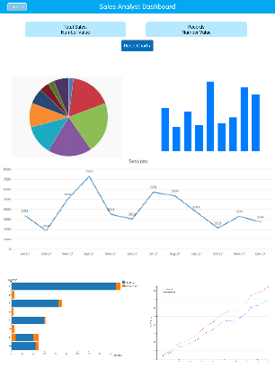
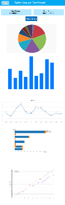

# Game Sales Dashboard

This dashboard provides information on games sales. It gives us some insite into which generes are most
popular and which gaming platform is most in demand plus much more. This gives us a much more interactive way of taking in the given data and allows the user to consume lots of information in a visual manner.

## Data Set

The data set used for this project was taken from kaggle It includes data such as Global Sale, Platform , years and some more.A link to which can be found below.
[Data-Set](https://www.kaggle.com/gregorut/videogamesales)

## Ux

Games Sale Dashboard was built for both gamers and managers alike. It allows those who are interested in gaming to see whats the best platrom to be on for a particular genre they are interested in. It provides the data in such a way that you dont need to be a data scientist to understand it. Its also great for project managers as although the data I have used may not be the most realistic it does showcase the power of d3.js, dc.js and crossfilter. To create a powerful dashboard with a given dataset.

### User Stories

- As a gamer this allows me to see all of the realivent data of interest to me .
- Such as rthe abilty to see whats the most popular platform right now.
- The abilty to see which platform is right for you based on which type or genre of game you like.
- This dashbaord also demonstrates to managers how good d3 ,dc and crossfilter can be to display sales analytics.

## Ui

For User Interface experience I kept my design simple and stuck with what I originally had designed from my wireframes. I also made a conscious decision to build the dashboard for desktop and at a minimum an Ipad sized screen as the graphs become unreadable on smaller devices. I wanted to dashboard to target audiences on larger devices.

#### WireFrames

|                Desktop                 |                Ipad                 |
| :------------------------------------: | :---------------------------------: |
|  |  |

## Current Features

- ### Reset Charts button

  Simple button that allows the user to Reset Chart Data to its orginal unfiltered state

- ### Display of Total Value and Total Records

  A display box which shows the user the total value and the total amount of records currently being displayed with the current filter

- ### Tutorial Button

  A simple button which allows the user to take a quick tour through the dashboard giving them simple tool tips of each item.

- ### Back To The Top Button

A simple button at the bottom which allows the user to navigate back to the top of the dashbord

## Features left to implment

- ### Drop Down Navbar

  A drop navbar which will allow the user to navigate through diffrent areas in the dashboard.

- ### Dark Mode
  A dark mode which will allow the user to toggle from a light background to a darker background to make it more acessible for all users

## Technologies Used

- #### HTML5
- #### CSS3 / CSS Grid
- #### Javascript / Jquery
- #### D3.js

  D3 is a JavaScript library for visualizing data with HTML, SVG, and CSS.

  [Learn More About D3 Here](https://d3js.org/)

- #### Dc.js

  Dc is a javascript charting library with native crossfilter support, allowing highly efficient exploration on large multi-dimensional datasets (inspired by crossfilter's demo). It leverages d3 to render charts in CSS-friendly SVG format. Charts rendered using dc.js are data driven and reactive and therefore provide instant feedback to user interaction.

[Read More On DC.js Here](https://dc-js.github.io/dc.js/)

- #### Crossfilter
  Crossfilter is a JavaScript library for exploring large multivariate datasets in the browser.
- #### Figma
  Was used to produce wire frames
- #### Kaggle
  I used kaggle to get my datasets

## Testing

### Responsiveness

I've tested the responsiveness of my project using Chrome developer tools. I did this by right clicking on my webpage when in chrome and clicking inspect. I tested both the full width of my Monitor and on Ipad. ALso I noticed when I selected the Ipad that everything looked huge but once I zoomed out everything looked okay. I found on smaller screen sizes such as the Iphone5 although the charts where scaling the text under each chart became unreadable.

### Physical

For the physical hardware, the project was tested on a asus 22 inch 1080p monitor, a 2011 macbook pro and a Dell 15.6 inch 1080p laptop. All of which looked as I expected.

### Data Testing

Throught out the making of this project I performed manual testing on each chart.Ensuring that the data was filtering correctly. Its also worth noting that console logged each piece of data to ensure that everything was working correctly. As a result all charts are fully interactive and filtering data correctly.

#### Testing Procuder

- Before I generated each chart I made sure to log each dataset for the given chart to the console.

- This allowed me to ensure that the corrrect data was being produced for each and every chart.

- I extensivly tested each chart by clicking on it to make sure that it was indeed filtering the data correctly.

## Deployment

I have used GitHub Pages to deploy my site from the master branch.

[Link To Site](https://conoroshea1996.github.io/Dashboard/)

These are the following steps I took to deploy my site

- I selected the Dshboard Project from my list of repositories.

- Then I went to the settings tab in my github repository.

- I then scrolled down to Github Pages section.

- I clicked where it says source none and change this to the master branch

- After a couple of mintues there is then a live link to this project.

- All future commits to the master branch will automatically update the live link to the site

- It's also worth noting that the site must have an index.html file. In order for github to deploy the site correctly

## Content

The data set was taken from Kaggle and can be viewed.
[here](https://www.kaggle.com/gregorut/videogamesales)
